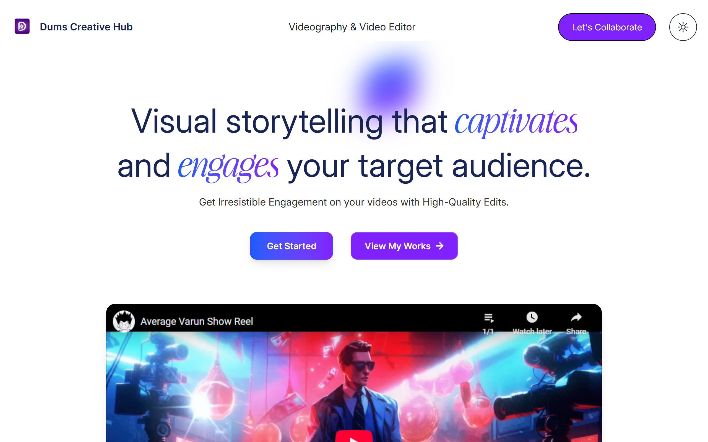
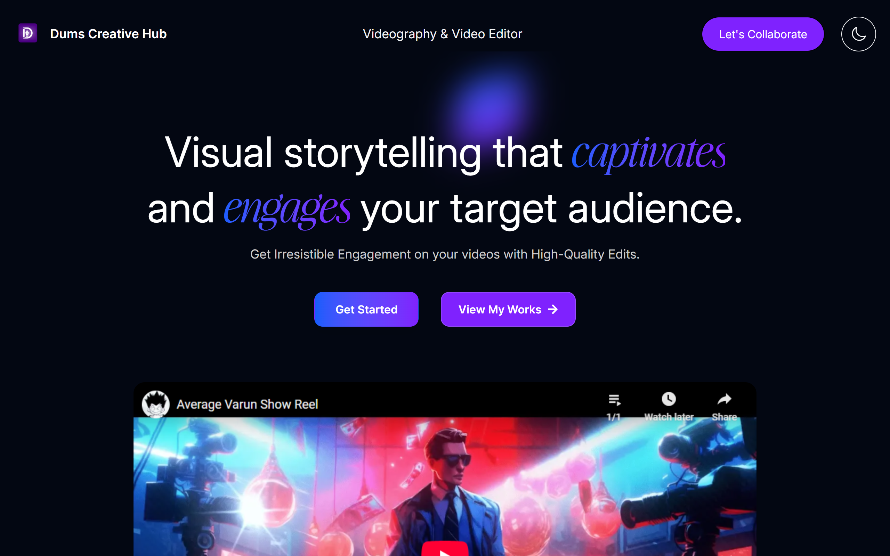

# Dums Creative Hub 🎬✨

Dums Creative Hub is a clean, minimal, and modern one-page portfolio website built for a professional video editor. The design emphasizes creativity, user experience, and performance. Built using React and Tailwind CSS, the site includes a responsive design, dynamic content powered by Sanity CMS, and smooth animations with Framer Motion.

## 🌐 Live Demo

[🔗 Visit Live Site](https://dums-creative-hub-portfolio.vercel.app/)

---

## 📸 Screenshots

### 💡 Light Mode



### 🌙 Dark Mode



---

## 🚀 Features

- 🌓 Light & Dark Theme Toggle
- 🎥 Video Intro Section powered by Sanity
- 📁 Google Drive Button (fully editable via Sanity)
- 🖼️ Auto-scrolling Testimonials Carousel (fetched from Sanity)
- 🎨 Dynamic Work Gallery (Long Form, Short Form, Motion Graphics — all from Sanity)
- 📋 Editable FAQs from Sanity CMS
- 👤 “About Me” Section editable via Sanity
- 🔗 Social Media Footer (Sanity-powered links and icons)
- 💬 Smooth Client Testimonials with Drag or Auto-scroll
- ✨ Framer Motion Animations
- 📱 Fully Responsive (Mobile-first)

---

## 🧠 Powered by Headless CMS

The portfolio is now fully integrated with [Sanity](https://www.sanity.io/) for real-time content management.  
Clients or editors can easily update:

- YouTube intro video
- Long form, short form & motion graphics videos
- FAQ content
- About Me section
- Testimonial cards
- Google Drive button link
- Social media profiles

All changes update automatically — no code or redeploy needed.

---

## ⚙️ Technologies Used

- [React.js](https://reactjs.org/)
- [TypeScript](https://www.typescriptlang.org/)
- [Tailwind CSS](https://tailwindcss.com/)
- [Framer Motion](https://www.framer.com/motion/)
- [Sanity CMS](https://www.sanity.io/)
- [Vite](https://vitejs.dev/)

---

## 🛠️ Getting Started

### Prerequisites

Make sure you have the following installed:

- Node.js (v18+)
- npm or yarn
- Sanity CLI (`npm install -g sanity`)

### Installation

```bash
# Clone the repository
git clone https://github.com/Ozioma45/Dums_Creative_Hub_Portfolio.git

# Navigate into the project
cd Dums_Creative_Hub_Portfolio

# Install frontend dependencies
npm install
# or
yarn install

# Go to the backend (CMS) folder
cd backend-sanity
npm install

# Start the Sanity Studio locally
sanity dev
```

### Run Frontend Locally

```bash
# Go back to frontend folder
cd ..

# Run the dev server
npm run dev
```

---

## 🔗 Socials

Follow and connect with **Dums Creative Hub** on:

- [Instagram](https://instagram.com/dums_creativehub)
- [YouTube](https://youtube.com/@dumscreativehub)
- [TikTok](https://tiktok.com/@dums_creativehub)

---

## ✍️ Author

**Built & Designed by [Ozioma John Egole](https://github.com/ozioma45)**
© 2025 Dums Creative Hub

> _“Creating for the future of video.”_

---

## 📌 License

This project is licensed for personal and commercial portfolio use. Attribution is appreciated.

```

```
